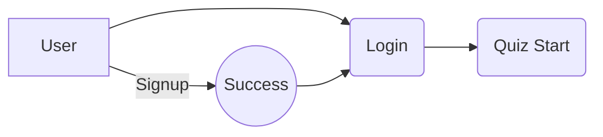

# Quiz Web Application

Hi! I'm Shivang Saxena Creating this **Quiz APP** using **Python** Framework **Flask** using Modular Programing Approach.

# Technology Stack

<h5>Frontend</h5>
	
	HTML
	CSS
	Jquery
	Javascript
	AJAX

<h5> Backend </h5>
	
	Python
	Flask
	RESTAPI
	MongoDB

## Folder Structure

```
.
├── Backend
│   ├── app
│   │   ├── config
│   │   │   └── config.py
│   │   ├── controllers
│   │   │   ├── auth
│   │   │   │   ├── emailSender.py
│   │   │   │   ├── helper.py
│   │   │   │   ├── index.webp
│   │   │   │   ├── __init__.py
│   │   │   │   ├── loginUser.py
│   │   │   │   ├── logoutUser.py
│   │   │   │   ├── refreshToken.py
│   │   │   │   └── registerUser.py
│   │   │   └── quiz
│   │   │       ├── __init__.py
│   │   │       └── quiz.py
│   │   ├── __init__.py
│   │   ├── routes
│   │   │   └── __init__.py
│   │   ├── services
│   │   │   ├── customErrorHandler.py
│   │   │   ├── __init__.py
│   │   │   └── JwtService.py
│   │   ├── validator
│   │   │   ├── __init__.py
│   │   │   └── userValidate.py
│   │   └── views.py
│   └── run.py
├── Frontend
│   ├── static
│   │   ├── css
│   │   │   └── style.css
│   │   └── js
│   │       ├── jquery.js
│   │       ├── style.js
│   │       └── sweetalert.js
│   └── templates
│       ├── base.html
│       ├── end.html
│       ├── index.html
│       ├── login.html
│       ├── quiz.html
│       └── signup.html
└── Readme.MD
```

# Flow of Application

This Application is based on Token based Authentication so

- First User **SignUp** .If SignUp is Successfull then a Verification Link is Send to user **Email**
  Address.
- After Click on **Verification Link** user will redirect to **Login**
  Page through which user can Login.
- After Successfull Login User can start the **QUIZ**. After Completed Quiz user score will Display on screen.

## Visual diagrams

And this will produce a flow chart:



# Important DATA to RUN Application [ENV FILE]

```env
APP_PORT=5000
DEBUG_MODE=true
DB_URL=mongodb://localhost:27017/Quiz
JWT_SECRET=************************
REFRESH_SECRET=********************
APP_URL=http://localhost:5000
ACCESS_TOKEN_TIMEOUT=60
REFRESH_TOKEN_TIMEOUT=400
SECRET_KEY=*******************
EMAIL_TOKEN=*************
EMAIL_VERIFICATION_APPLY=NO
```

# Note

- EMAIL_TOKEN is required so that Email can be forward
- Replace **\*\*** with some strong secret Key
- If you don't want EMAIL Verification then put it as NO otherwise make it YES
- When it set NO then no need to check email for verification ignore the message of Verification Link send to Email Address after being successfully Registered Yourself.
- Make APP_URL Default localhost and PORT 5000. If you want to you can change it but also you have to change in Some HTML file as well.

# RESTAPI

    AUTH
    	[+] : http://localhost:5000/v1/auth/register
    	[+] : http://localhost:5000/v1/auth/login
    	[+] : http://localhost:5000/v1/auth/refresh
    	[+] : http://localhost:5000/v1/auth/verify
    Quiz
    	[+] : http://localhost:5000/quiz

# How to run

```bash
git clone
cd QUIZAPP
cd Backend
pip3 install requirement.txt
python3 run.py
```

# Contributing

When contributing to this repository, please first discuss the change you wish to make via issue,
email, or any other method with the owners of this repository before making a change.

Please note we have a code of conduct, please follow it in all your interactions with the project.
